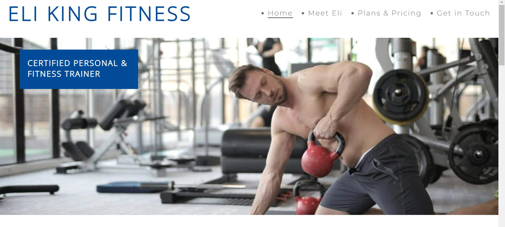
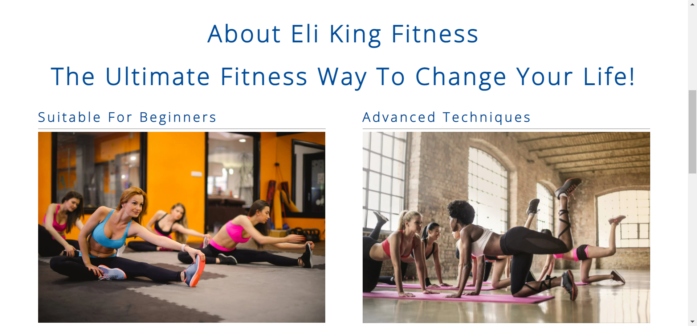
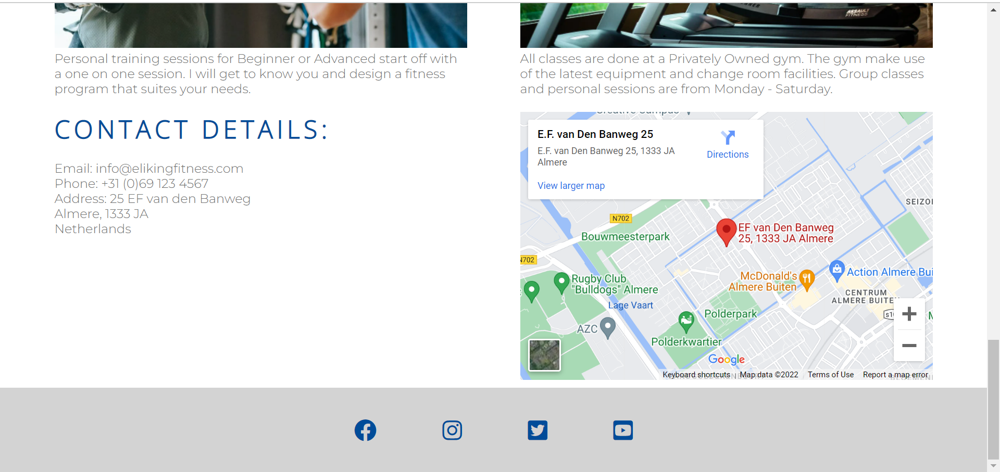
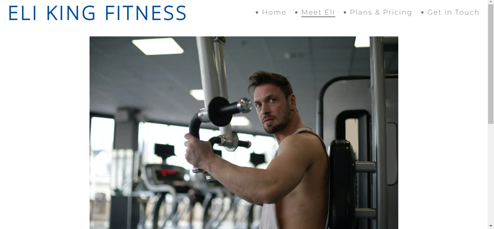
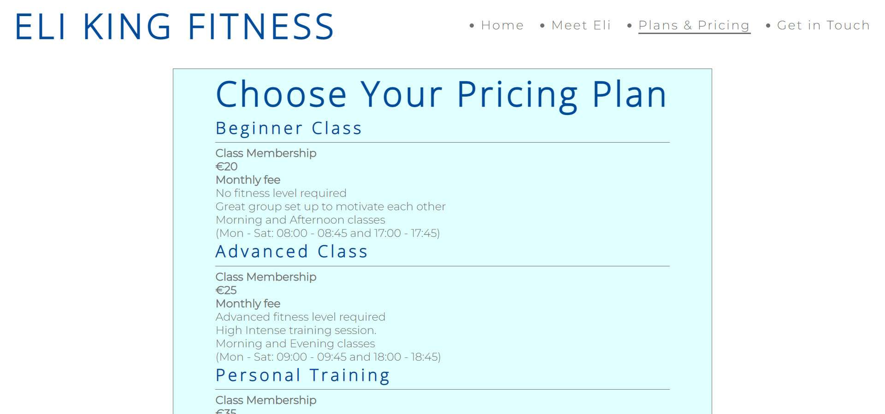
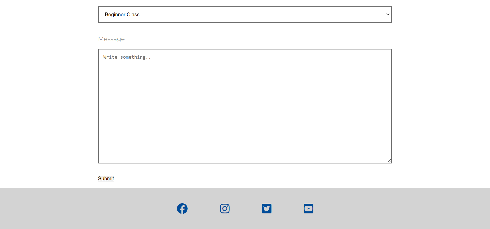

# ELI KING FITNESS
## Introduction

Eli King Fitness is a website of a personal trainer advertising his services in Almere, Netherlands. Eli King Fitness offers personal training classes and also group classes for Beginners and Advanced fitness enthusiasts.

Users of this website will be able to learn more about the founder himself Eli King, the group class schedules and time slots for personal training sessions. The website will also provide information of the different prices for each group class and private session, contact details and where the gym is located.

## [View life website in github pages](https://clayc03.github.io/eli-king-fitness/) 

<u>*Disclaimer - This website is for educational purpose only*</u>

## **[Table of Contents](#contents)**
1. **[Features](#features)**
2. **[Testing](#testing)**
3. **[Technology](#technology)**
4. **[Deployment](#deployment)**
5. **[Credits](#credits)**
6. **[Screenshots](#screenshots)**

1. **[Features](#features)**
This website consists of five pages, four of these pages are accessible from the navigation menu.
The last page is linked to the contact form and is a submission confirmation page.

Below are the website features:

## Navigation bar

* The Navigation bar is consistant on each page:

    * The logo is on the left side, clicking on the logo will navigate the user back to the home   pageas.
    * The menu list on the right side consists of four links to each page:
        * Home
        * Meet Eli
        * Plans & Pricing
        * Get in Touch

## Home page - About Section

* The About section is on the homepage and gives information about the different classes be offered at Eli King Fitness and also a brief description about the facility where these classes take place. Also on the homepage is the address and a google map for address reference.

## Meet Eli

* This page gives information about the founder Eli King and his experience and qualifications obtained.

## Prices & Plans

* This page gives the user information on the different prices for each class (Beginner or Advanced) and private session as well as the schedule for each.

## Get in Touch

* This page the user can complete to get in contact with Eli King Fitness and for a response on any query or information required. This page is linked to a confirmation page that the users message was send successfully.

## Footer

* The Footer is consistent on each page. The Footer has links to social media websites, these links open in a seperate tab in a browser.

[Back to Table of contents](#table-of-contents)

2. **[Testing](#testing)**

## Functionality testing 

 I used Chrome developer tools throughout the project for testing and solving problems with responsiveness and style issues. I also used Firefox and Microsoft Edge to test the funcionality of the website on desktop and mobile compatibility using the websites developer tools.
 
 [Chrome DevTools](https://developer.chrome.com/docs/devtools/) was helpfull throughout the development of this website.

## Compatibility testing
 Using Lighthouse the site was tested across multiple virtual mobile devices. 

[Lighthouse](https://developers.google.com/web/tools/lighthouse) was helpfull throughout the development of this website for mobile and desktop compatibility.
 
I used a HP Pavilion laptop with Windows 11 Home throughout this project and used 2 x different monitors to connect (Samsung 24 inch and LG 27 inch). I also used my Huawei P30 Pro mobile to check the sites compatibility.

## Performance testing

I run [Lighthouse](https://developers.google.com/web/tools/lighthouse/) tool to check performance of the website.

Below are the final performance results received for both desktop and mobile compatibility in Lighthouse. 

I run the [Wave](https://wave.webaim.org/) tool for the website to see if there is any color contrast errors. 

Below is a screenshot of the Plans & Prices page who had the only contrast error for the website, I changed the background from lightblue to lightcyan to correct this error.

## Validator testing

I run the deployed site address in W3C Validator for HTML (https://validator.w3.org) and in (https://jigsaw.w3.org/css-validator/validator) for CSS and no errors or warnings was returned.

[Back to Table of contents](#table-of-contents)

3. **[Technology](#technology)**

For this website I used the following Technology:

HTML5
HTML5 is a markup language used for structuring and presenting content on the World Wide Web.

CSS
Cascading Style Sheets is a style sheet language used for describing the presentation of a document written in a markup language such as HTML.

Google fonts
Google Fonts is a computer font and web font service owned by Google. 

GitHub
A provider of Internet hosting for software development and version control using Git. 

Gitpod
An open-source developer platform for remote development.

Back to Table of contents

4. **[Deployment](#deployment)**

This milestone project was deployed to Github pages where a repository was created. All html and css code written / changes made was commited and pushed in Gitpod to save in Github.

* To deploy a project I had to:
  * In Github after creating the repository navigate to the settings tab.
  * Select the pages link on the left hand side. 
  * From the sources section click on the Branch button and select Main. 
  * After selection of the Main Branch the page will provide the link to the deployed site. 

[Back to Table of contents](#table-of-contents)

5. **[Credits](#credits)**

* To complete this project I used Code Institute student template: [gitpod full template](https://github.com/Code-Institute-Org/gitpod-full-template)

* Ideas and knowledge library:

    * [w3schools.com](https://www.w3schools.com)

    * [css-tricks.com](https://css-tricks.com/)

### Code

### Content:

### Map:
* [Google maps]()

### Images:

[Back to Table of contents](#table-of-contents)

6. **[Screenshots](#screenshots)**

## Project screenshots

